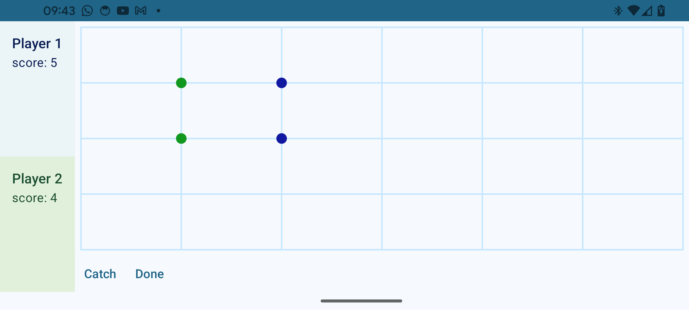

# Punkts-Spel

Det här är ett program som jag har kodat under ett skolprojekt.

### Verktyg som jag har använt:
- Kotlin för koden
- Jetpack Compose för UI-n
- Canvas för SpelBrädet
- Graph data structure för att representera ett graf
- DFS-algorithmför att detektera cykel i grafet

### Om programmet:
Programmet som ska utvecklas är ett spel som kallas för “Punkts spel”. Hur det spelas beskrivs nedan:  
- Minst två spelare deltar i spelet. Upp till fyra spelare kan delta, men inte mer för att minska konfusion. 
 Spelet har flera varianter som: tre spelare som spelar mot varandra, fyra spelare som spelar mot varandra 
 eller fyra spelare som spelar i part som två mot två. I prototypen begränsas deltagarna till två, 
 en mot en och en mot datorn för enkelhetens skull. 
- Spelet spelas i en kollegieblock med rutade blad. 
- Varje spelare sätter punkter i bladets rutornas hörn i tur, en efter den andra. 
 Spelarna måste ha olika punkt färger för att förenkla spelets utläsning.

- Målet är att omringa eller slå in varandras punkter med ens egna punkter. 
 Man gör det genom att sätta punkter kring den andra spelarens punkter med minst fyra punkter med ett streck emellan varandra. 
 Sedan kopplar man ihop prickarna med linjer kring  dem låsta punkterna för att visa att de är verkligen omringade och underlättar spelets utläsning.
- Omringade punkter kan inte användas för att omringa andra punkter, men punkter som omringar andra punkter kan användas för att omringa andra punkter som illustreras i bilden ovan. 
- I slutet är det den spelare som har omringat de flesta punkter som vinner.

