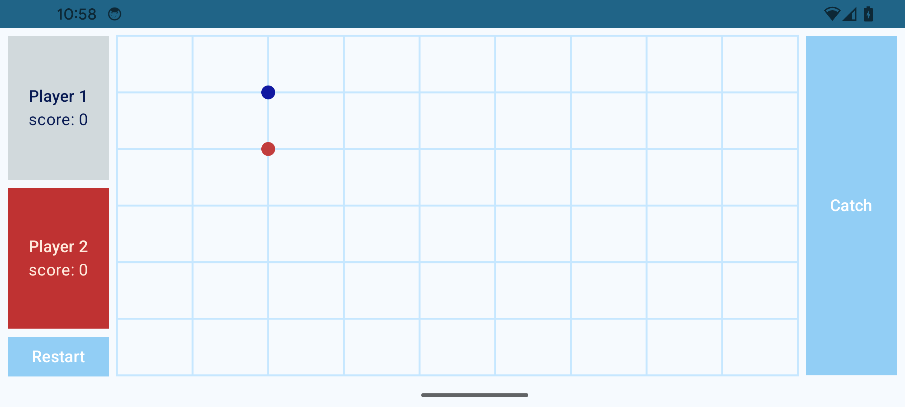
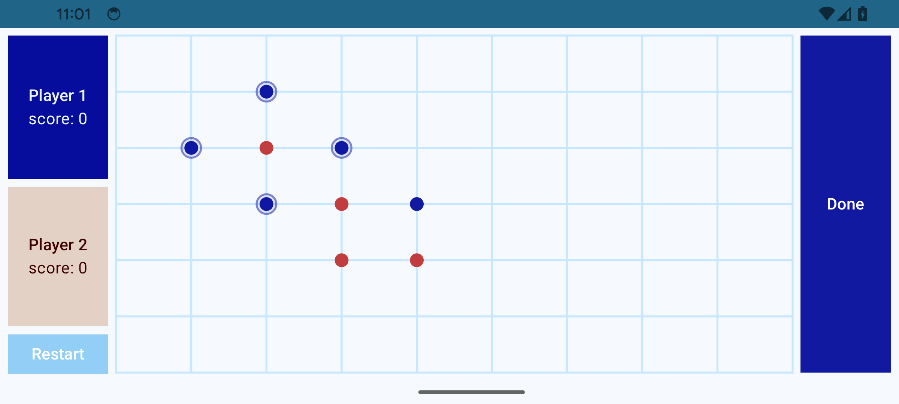
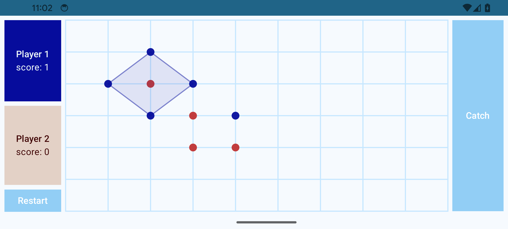
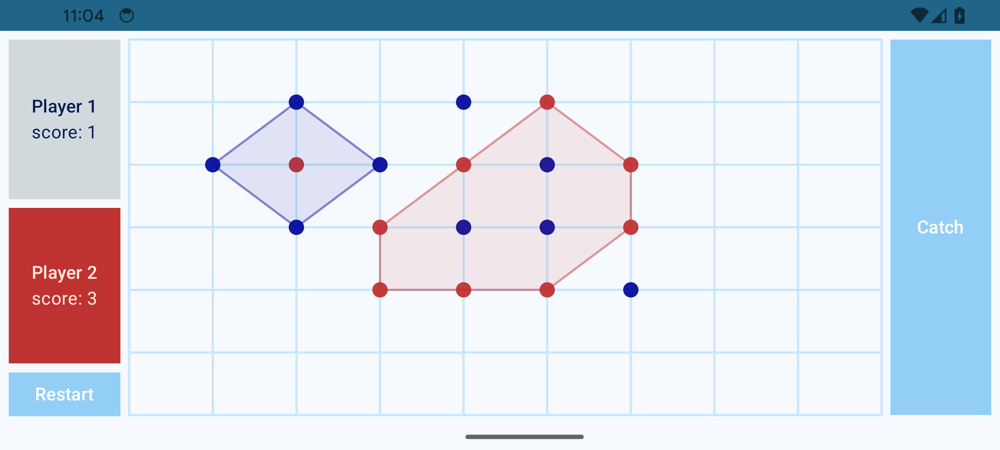

# Punkts-Spel

### Presentation: 
Det här är en digital version av ett spel som jag spelade med papper och penna när jag var liten med mina vänner. 
Programmet har jag kodat under ett skolprojekt.

### Verktyg som jag har använt:
- Kotlin för koden
- Jetpack Compose för UI-n
- Canvas för SpelBrädet
- Graph data structure för att representera ett graf
- DFS-algorithm för att detektera cykeln i en graf

### Hur spelet går:
- Spelarna sätter prickar per tur på spelbrädet.
- En spelare sätter en prick per tur. Om den har precis omringat kan den sätta en extra punkt.
- Ens tur är slut när man har klickat in på ens score panel. 

- Målet är att omringa eller slå in varandras punkter med ens egna punkter. 
  Man gör det genom att sätta  minst fyra punkter kring den andra spelarens punkter. 
  trycka på knappen “Catch”, välja de punkterna som omringar punkterna man vill omringa och  

- Efter att ha klickat på knappen “Catch”, körs en algoritm som kontrollerar om punkterna man har valt formar verkligen en cykel.
  Om så är fallet, ritas cykeln automatiskt och de inringade punkterna räknas. 
 
 

